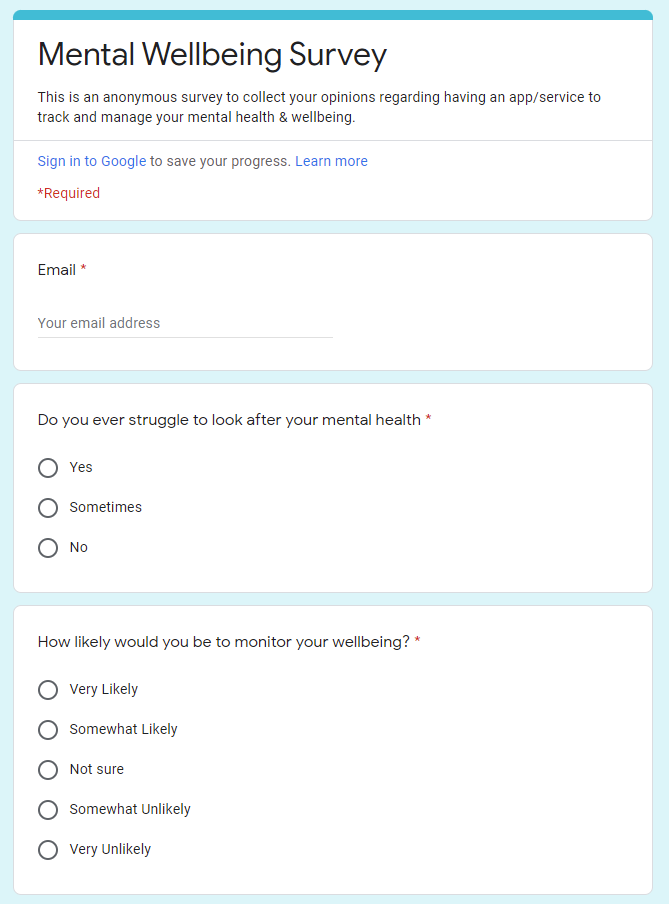

# User Requirements Survey

Thank you taking time to complete this survey. Group 19's systems engineering project builds on last year's (NudgeMe)[http://students.cs.ucl.ac.uk/2020/group26/] wellbeing application. This year, the main focus is on visualising the user's personal health and wellbeing data in a way which encorages them to use the system more frequently and share problems with clinicians. 

Survey link: [https://forms.google.com/G4eB7VueTgRWjmEw9](https://docs.google.com/forms/d/e/1FAIpQLSdVioWNxR166Ztrh4sHPphh0fXHVuz_SqgQdpjS0f-zh10BKA/viewform)

## Response Statistics

TODO
